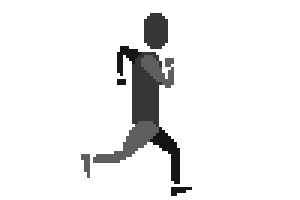

# Sprite

Sprite component.




## Installation

    npm install @pencil.js/sprite


## Examples

The easiest way to use sprites is using a spritesheet (a.k.a. Texture Atlas). A Spritesheet is a combination of a large image composed of smaller images
and a json file.
There're plenty of tools that can manage and generate spritesheets
([spritesheet.js](https://github.com/krzysztof-o/spritesheet.js), [TexturePacker](https://www.codeandweb.com/texturepacker), [ShoeBox](https://renderhjs.net/shoebox/) ...)

Pencil.js offer an easy way to load and use a spritesheet.
```js
import Sprite from "@pencil.js/sprite";

Sprite.sheet("spritesheet.json")
    .then((sheet) => {
        const position = scene.center;
        const selector = "image_*.png";
        const sprite = sheet.extract(position, selector);
        scene.add(sprite).startLoop();
    });
```

You can also use the `Sprite` class directly if you prefer.
```js
import Sprite from "@pencil.js/sprite";

const position = scene.center;
const url = "sprite-sheet.png";
const frames = [
   // list of frames data
];
const sprite = new Sprite(position, url, frames);
scene.add(sprite).startLoop();
```


