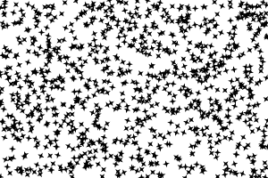

# Particles

Particle generator optimized to display thousands of instances.




## Examples

```js
import { Particles, Star, Math as M } from "pencil.js";

const count = 5000;
const position = [100, 200];
const base = new Star();
// Additional parameters after the first one come from the generate method call
const generator = (index, any, additional, params) => {
    return {
        position: scene.getRandomPosition(),
        rotation: M.random(),
        scale: M.random(0.5, 1.5),
        ttl: 100,
        // And whatever value you want to define for each individual particle, for example
        speed: new Position(1, 0).rotate(M.random()),
    };
};
const updater = (data, index) => {
    data.position.add(data.speed);
};

const particles = new Particles(position, base, generator, updater);
// Any parameters after the first one are passed to the generator function
particles.generate(count, any, additional, params);
```


## ParticlesData

`ParticlesData` stores individuals information about each particle.
It supports a limited number of properties.

| Name | Type | Default | Comment |
| ---- | ---- | ------- | ------- |
|`position` |[`Position`](../position) |`new Position()` |Position of the particle |
|`rotation` |`Number` |`0` |Rotation applied to the particle |
|`scale` |`Number` or `Array` |`1` |Scaling ratio or a pair of value for horizontal and vertical scaling |
|`ttl` |`Number` |`undefined` |Time to live, number of frames the particle is displayed. This number will be decremented and the data removed when it reach 0 |

The data object can also be used to store any other individual values for each particle.


## ParticlesOptions
Inherit from [ComponentOptions](../component/readme.md#componentoptions).

Particles have no specific options.
